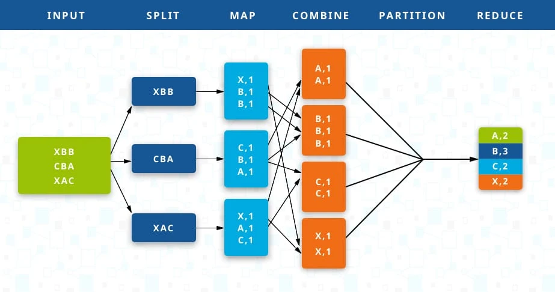
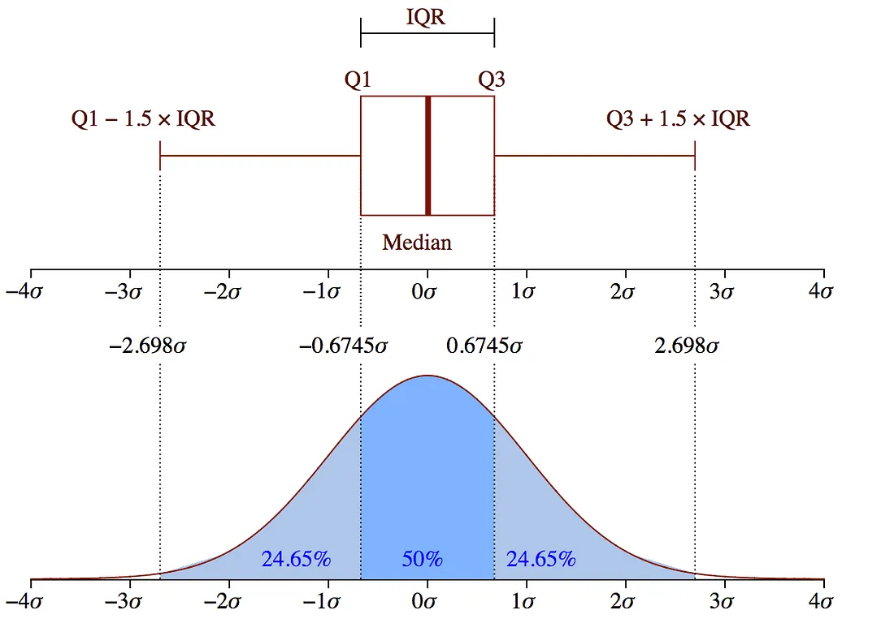

# Microsoft AI Interview Questions

**Link**: https://medium.com/acing-ai/microsoft-ai-interview-questions-acing-the-ai-interview-be6972f790ea

1. [Merge k arrays (in this case k = 2) and sort them](#merge-k-arrays-in-this-case-k--2-and-sort-them)
2. [How to best select a representative sample of search queries from 5 million?](#how-to-best-select-a-representative-sample-of-search-queries-from-5-million)

## Merge k arrays (in this case k = 2) and sort them.

It is simple to concatenate the two arrays. Then, we can use the quicksort function, which has the highest (`O(nlogn)`) average case complexity. 

```python
def merge_arrays(arr1, arr2):
    # Concatenate two arrays.
    arr = arr1 + arr2
	
    def partition(arr, low, high):
        pivot = arr[high]
        i = low - 1
        for j in range(low, high):
    	    if arr[j] <= pivot:
    		    i += 1
    		    arr[i], arr[j] = arr[j], arr[i]
        arr[i + 1], arr[high] = arr[high], arr[i + 1]
    	return i + 1
    
    def quicksort(arr, low, high):
    	if low < high:
    	    pi = partition(arr, low, high)
    	    quicksort(arr, low, pi - 1)
    	    quicksort(arr, pi + 1, high)
    
    quicksort(arr, 0, len(arr) - 1)
    return arr
```

The `partition()` function pivots two arrays around a pivot element. The `quicksort()` function is defined to recursively sort the array using the `partition()` function. The `low` and `high` parameters define the indices of the subarray that needs to be sorted. We recursively sorted the subarrays to the left and right of the pivot.

`partition()` selects a pivot element, which is the element at the `high` index. The `i` variable keeps track of the index of the last element that is smaller than or equal to the pivot. The function then iterates over the subarray from `low` to `high - 1`, and for each element that is smaller than or equal to the pivot, it swaps it with the element at index `i + 1`. Finally, the pivot element is swapped with the element at index `i + 1`, placing the pivot element in its correct sorted position.

In `quicksort()`, if `low` is less than `high`, it calls the `partition()` function to partition the subarray, and then recursively calls the `quicksort()` function on the subarrays to the left and right of the pivot.

Alternatively, using bubble sort:

```python
def merge_arrays(arr1, arr2):
    arr = arr1 + arr2
    for i in range(len(arr) - 1):
        for j in range(i, len(arr)):
            if arr[i] > arr[j]:
                # Swap
                temp = arr[i]
                arr[i] = arr[j]
                arr[j] = temp
    return arr
```

Bubble sort isn't the most efficient, but it is easy to describe and implement. Starting from the first element, compare each adjaceny pair of elements and swap them if they are in the wrong order. After the firsrt pass, the largest element will be at the end of the list. Repeat the process, but exclude the last element from the comparison since it is already in the correct position. After each pass, the number of elements to compare decreases by 1, since the largest element is already in its correct position.

For `k > 2`:

```python
def merge_arrays(*args):
    arr = []
    for a in args:
        arr.extend(a)
    ...
```

## How to best select a representative sample of search queries from 5 million?

For an ML model, we want the minimum amount of information that is required to learn properly from a phenomenon. We don't want information redundancy, as that doesn't contain any business value. In order to take a small dataset, we must be sure we don't lose statistical significance with respect to the population. We want our sample to keep the probability distribution of the population under a reasonable significance level. The easiest thing to do is take a random sub-sample with a uniform distribution and check if it's significant or not.
- One simple approach considers each variable independently of the others. If each one of the single univariate histograms of the sample columns is comparable with the correspondent histogram of the populations, we can assume the sample is not biased. We would repeat this for all variables. We don't have to worry about the correlation between variables if we select our sample uniformly. 
- Comparing the sample and population: Compare categorical variable with the chi-square test, and numerical variables with the KS-test. Both statistical tests work under the null hypothesis that the sample has the same distribution as the population.
- Since a sample is made by many columns and we want all of them to be significant, we can reject the null hypothesis is the $p$-value of at least one of the tests is lower than the confidence level. We want every column to pass the significance test in order to accept the sample as valid.

## Three friends in Seattle told you it's rainy. Each has a probability of 1/3 of lying. What's the probability that Seattle is actually rainy? Assume a prior probability of 0.25 for Seattle being rainy.

For Seattle to be rainy, our friends have to be telling the truth, of which there is a probability of 2/3. So, we should simply find the probability that Seattle is rainy and our friends are telling the truth.

$$
P(\text{raining} | \text{all say yes}) = \frac{P(\text{all truth}) \cdot P(\text{rain})}{P(\text{all say yes})}
$$

There are two things that can happen when all three of our friends say yes: They could all be lying (saying yes and Seattle is not rainy) or all telling the truth (saying yes and Seattle is rainy). So, the probability of each of these will be P(all say yes).

$$
P(\text{raining} | \text{all say yes}) = \frac{P(\text{all truth}) \cdot P(\text{rain})}{P(\text{all lie and Seattle is not rainy}) + P(\text{all tell the truth and Seattle is rainy})}
$$

Plug in the values:

$$
P(\text{raining} | \text{all say yes}) = \frac{(2/3)^2 \cdot 0.25}{(1/3)^2 \cdot 0.75 + (2/3)^2 \cdot 0.25} \approx 0.57
$$

## Can you explain the fundamentals of Naive Bayes? How do you set the threshold?

Naive Bayes classifiers are a collection of classification algorithms. These classifiers are a family of algorithms that share a common principle. NB classifiers assume that the occurrence of absence of a feature does not influence the presence or absence of another feature ("naive" assumption). Bayes' Theorem is how we find a probability when we know other probabilities. In other words, it provides the posterior probability of a prior knowledge event. This theorem is a principled way of calcultaing conditional probabilities.

When the assumption of independence holds, they are easy to implement and yield better results than other sophisticated predictors. They are used in spam filtering, text analysis, and recommendation systems.

One approach for finding the optimal threshold is the ROC curve, of which the X-axis is the false positive rate and the Y-axis is the true positive rate. The ROC curve is a graphical representation of the performance of a classification mdoel at all thresholds. It has two thresholds: true positive rate and false positive rate. AUC (Area under the ROC curve) is simply, the area under the ROC curve. AUC measures the two-dimensional area underneath the ROC curve from (0, 0) to (1, 1). It is used as a performance metric for evaluating binary classification models. We could use the G-Mean as a metric, which is the geometric mean of precision and recall. It is defined as:

$$
\sqrt{\text{TPR}\cdot(1-\text{FPR})}
$$

The G-mean is an unbiased evaluation metric and the main focus of threshold moving. And we could visualize where the G-mean occurs on the ROC curve, which is calculated from the predicted probabilites.

## Can you explain what MapReduce is and how it works?

MapReduce facilitates concurrent processing by splitting petabytes of data into smaller chunks, and processing them in parallel on Hadoop commodity servers. At the crux of MapReduce are two functions: Map and Reduce. They are sequenced one after the other.
- **Map**: Takes input from the disk as <key, value> pairs, processes them, and produces another set of <key, value> pairs as output.
    - The input data is first split ito smaller blocks. Each block is then assigned to a mapper for processing.
    - If a file has 100 records to be processed, 100 mappers can run together to process one record each. The Haoop framework decides how many mappers to use, based on the size of the data to be processed and the memory block available to each mapper server.
- **Reduce**: Takes inputs as <key, value> pairs, and produces <key, value> pairs as ouput.
    - After all the mappers complete processing, the framework shuffles and sorts the results before passing them on to the reducers. A reducer cannot start while a mapper is still in progress. All the map output values that have the same key are assigned to a single reducer, which then aggregates the values for that key.

Two intermediate steps:
- **Combine**: Optional process. Reduces data on each mapper further to a simplified form before passing it downstream.
- **Partition**: Translates <key, value> pairs resulting from mappers to another set of <key, value> pairs to feed into the reducer. It decides how the data has to be presented to the reducer and assigns it to a particular reducer.
    - Default partitioner determines the hash value for the key, resulting from the mapper, and assigns a partition based on its hash value.



## Can you explain SVM?

SVM is a supervised machine learning algorithm which works on both classifiaction and regression problems. It tries to classify data by finding a hyperplane that maximizes the margin between the classes in th etraining data. Hence, SVM is an example of a large margin classfiier. The basic ideas of support vector machines:
- Optimal hyperplane for linearly separable patterns
- Extend to patterns that are not linearly separable by transformations of original data to map into new space (kernel trick)

## How do you detect if a new observation is an outlier?

1. **Standard Deviation**:
- Check if a data point is more than three times the standard deviation. In a normal distribution, it would be greater or less than about 99.7 percent of the data.

2. **Boxplots**:

- The lower and upper whiskers are the boundaries of the data distribution. (Lower and upper quartiles are the edges of the box, by contrast.) The outliers will be outside the whiskers.



3. **DBScan Clustering**:

- Can be used as a density-based anomaly detection method with either single or multi-dimensional data. Other clustering algorithms such as k-means or hierarchical clustering can be used. DBScan has three concepts:
	- **Core points**: First hyperparameter is `min_samples`. This is the minimum number of core points needed in order to form a cluster, the second hyperparameter is `eps`, which is the maximum distance between two samples for them to be considered as in the same cluster.
	- **Border points**: Border points are in the same cluster as core points but much further away from the center of the cluster.
	- **Noise points**: Rest of the points, points that do not belong to any cluster. These can be anomalous or non-anomalous and they need further investigation.
- The downside of this method is that the higher dimension, the less accurate it becomes. Also, we would need to make a few assumptions, like estimating the right value for `eps`.

4. **Isolation Forest**:

- An unsupervised learning algorithm that belongs to the ensemble decision trees family. 
- This approach works differently in that it explicitly isolates anomalies instead of profiling and constructing normal points and regions by assigning a score to each data point. It takes advantage of the anomalies being the minority data points and they have attribute values that are very different from those of normal instances. This algorithm works better with high-dimensional datasets.
- It partitions data recursively using random splits. 
- The limitations are that the final anomaly score depends on the contamination parameter, which implies that we should have an idea of what percentage of the data is anomalous beforehand to get a prediction. Also, the model suffers from a bias due to the way the branching takes place.

## What is the bias-variance tradeoff?

With any model, we generally are trying to estimate a true underlying:

$$
y=f(x)+w
$$

To assess how well the model fits, we can decompose the error of y as the following:
1. Bias (how well the values come close to the true f(x) values)
2. Variance (how much the prediction changes based on training inputs)
3. Irreducible error (due to inherently noisy observation processes)

There is a tradeoff between bias and variance, and this is a useful framework for thinking about how different models. The overall goal is to control overfitting. The equation of the tradeoff can be expressed by: `Total model error = Bias + Variance + Irreducible error`.

## How would you implement autocomplete?

See the ML system design doc.

## Describe the working of gradient boost.

It works on the concept of the stagewise addition method, where many weak learners are trained, and in the end, we get a strong learner as a result. A particular weak learner is trained on the dataset, and the errors or mistakes made by the algorithm are notes. Now, while training a second weak learner algortihm, the errors and te mistakes made by the previous algorithm are passed into the second weak learner algorithm to avoid the same mistake.

The prediction of the first model is always the mean of the target training data. Once we have the set of predictions from the first weak learner, the residual or error is calculated in the first model. Now, while training the second model or weak learner, the training data will be the same as the first model's training data, but the target column would e the residual column from the first model. Here, the residuals will used as the target variables, and the model will be trained on that. The process is done over again for new models until we have zero values for the residual column.

**Weak learners** are models that perform slightly better than random guessing. **Strong learners** are ones that ahave arbitrarily good acurary.

**Assumptions**
1. The training dataset consists of numerical and/or categorical data.
2. The loss functions should be differentiable at all points.
3. There is no restriction for the number of iterations.

## Find the maximum sum of a subsequence in an integer list.

To return the sum:

```python
def maxSubsequenceSum(arr):
    max_sum = float('-inf')
    cur_sum = 0
    for num in arr:
        cur_sum = max(cur_sum + num, num)
        max_sum = max(max_sum, cur_sum)
    return max_sum
```

## What would you do to summarize a Twitter feed?

Get Twitter data using either the Twitter API or web scraping. Two ways to summarize:
- **Extractive summarization**: Rank the sentences in a text on the basis of the similarity they share with the text. The top-ranked sentences are returned as summary. These are fast in terms of retrieval time but precision values may fall in certain cases of multi-domain summary generation.
- **Abstractive summarization**: Find out semantic context and embedded meaing of the words and sentences. It involves heavy usage of NLP and supervised learning techniques thus it is slow in comparison to extractive summarization, but precision-wise, it performs well.

The data on Twitter is a type of single domain multi-document text data, i.e., several tweets collectively represent the opinion on a single topic in trend. In order to generate the grount truth of tweet summaries, we could pick the summaries out of the text after multiple reading of the tweets in steps and remove the redundant portion out of the summary generated.

A commonly used algorithm for extractive text summarization is the *Textrank algorithm* based on Pagerank for links in the web. In Textrank, sentences are first weighted on the basis of a similarity metric. Cosine similarity between the sentences is generally used to give the initial weights to the sentences and a directed graph is constructed of the sentence cluster where each sentence forms the node of the graph, while edges are links between the sentences on the basis of similarity between them.

$$
\text{Rank}(u) = \frac{1-d}{N} + d\sum_v (\text{rank}(v) / \text{degree}(v))
$$

`d` is a damping parameter which determines the probability of the *teleport operation* (chance of jumping to any random sentence or link).

The problem with this is that it fails to capture the semantic knowledge of the text. The words in the text have underlying meaning which can be the basis of extracting important word features. So, in order to optimize the score produced by Textrank, we could use a hybrid algorithm that uses the techniques of "abstraction" along with that of extraction without compromising the speed of extractive summarization.

**Hybrid algorithm**
Phase 1: Textrank from graph
Phase 2: 
1. Rank words according to the IDF score and provide top 10 words extra weight
2. POS tagging is performed on sentences and weight is given to nouns and adjectives.
3. Group synonymous words.
4. Wu-Palmer similarity calculation on synonym sets

In phase 2, after some basic preprocessing (hashtag removal, URL removal, sentence tokenization, word tokenization, etc.) the top 10 words can be extracted based on the inverse document frequency of the words, considering each sentence as a unique document. The sentences that contain these words are given extra weight.

For abstraction, perform POS tagging. The sentences carrying nouns and adjectives would get extra weight. Then, use the previously extracted top words, and compare them with the other words in each sentence (using Wu-Palmer similarity). Add the similarity score to the sentence score.

Evaluate using the ROUGE score. A ROUGE score close to zero indicates poor similarity between candidate and references. A ROUGE score close to one indicates strong similarity between candidate and references.

## How to deal with imbalanced binary classification?

1. **Metrics**: Many fall into the trap of using misleading metrics, like accuracy. In a dataset with highly imbalanced classes, the classifier will always predict the most common class ithout performing any analysis of the features, and it will impute a high accuracy.
	- **Precision**: How many of the positive predictions were predicted correctly?
	- **Recall**: How many of the actual positive values were predicted as positive?
	- **F1**: Weighted average between precision and recall
	- **AUROC**: Likelihood of your model distinguishing observations from two classes. In other words, if you select one observation from each class, what's the probability that your model will "rank" them correctly? Remember that AUROC is a ranking statistic.
2. **Resampling**: Over-sample the minority class (risk of overfitting, especially if we duplicate with replacement) or under-sample the majority class (loss of information)
	- One under-sampling method is *Tomek links*, which are pairs of very close instances that are in opposite classes. Removing the instances of the majority class of each pair increases the space between the two classes, facilitating the classification process.
	- An over-sampling technique is SMOTE. Randomly pick a point from the minority class and compute the k-nearest neighbors for this point. Synthetic points are added between the chosen point and its neighbors.
3. **Cost-Sensitive Training**: Use penalized learning algorithms that increase the cost of classification mistakes in the minority class. We can use the argument `class_weight="balanced"` to penalize mistakes on the minority class proportional to how under-represented it is.

## Define variance.

Variance measures the average squared distance of data points from the mean.

## What is the difference between a box plot and a histogram?

Boxplots are used when trying to show a statistical distribution of one variable or compare the distributions of several variables. Histograms are better at determining the probability distribution of the data; however, boxplots are better for comparison between dataasets and they are more space-efficient.

## How do you solve the L2-regularized regression problem?

Ridge regression adds a squared magnitude of the coefficients as a pentalty term to the loss function.

$$
\sum_{i=1}^{n}(y_i-\sum_{j=1}^{p}x_{ij}\beta_j)^2 + \lambda\sum_{j=1}^{p}\beta_j^2
$$

Unlike Lasso, Ridge regression doesn't shrink a feature's coefficients to zero, thus removing the feature altogether.

## How to compute an inverse matrix faster by playing around with some computational tricks?

We can use Gauss-Jordan elimination, which relies upon three elementary row operations:
1. Swap the positions of two rows
2. Multiply one of the rows by a nonzero scalar
3. Add or subtract the scalar multiple of one row to another row

This would convert the matrix into reduced-row echelon form. A matrix is in RREF if the following conditions are satisfied:
1. All rows with only zero entries are at the bottom of the matrix
2. The first nonzero entry in a row, called the pivot, of each nonzero row is to the right of the pivot above it.
3. The leading entry, or pivot, in any nonzero row is 1.
4. All other entries in the column containing a leading 1 are zeros.

Examples:

$$
\begin{bmatrix}
1 & 7 & 3 \\
0 & 1 & 0 \\
0 & 0 & 1 \\
\end{bmatrix}
$$

$$
\begin{bmatrix}
0 & 7 & 3 \\
1 & 0 & 0 \\
0 & 0 & 0 \\
\end{bmatrix}
$$

To perform Gauss-Jordan Elimination:
1. Swap the rows so that all rows with all zero entries are on the bottom
2. Swap the rows so that the row with the largest, leftmost nonzero entry is on top.
3. Multiply the top row by a scalar so that top row's leading entry becomes 1.
4. Add/subtract multiples of the top row to the other rows so that all other entries in the column containing the top row's leading entry are all zero.
5. Repeat steps 2-4 for the next leftmost nonzero entry until all the leading entries are 1.
6. Swap the rows so that the leading entry of each nonzero row is to the right of the leading entry of the row above it.

Double-check by making sure that:

$$
AA^{-1}=I
$$

## What is the difference between good and bad data visualization?

A good data visualization needs to be visually appealing to a user, and only has to give the user the right information and be easily acessible when necessayr. Good data visualization has the potential for easy scaling to cover future demands and takes a relatively small amount of time to develop and deploy.
- Use color to highlight important information
- Use one color to represent continuous data
- Avoid an indistinguishable color palette
- Accessible to color blind viewers

## How do you find percentile? Write the code for it.

```python
def percentile(data, percentile):
    sorted_data = sorted(data)
    index = (percentile / 100) * (len(sorted_data) - 1)
    if index.is_integer():
        percentile_value = sorted_data[int(index)]
    else:
        lower_index = int(index)
        upper_index = lower_index + 1
        lower_value = sorted_data[lower_index]
        upper_value = sorted_data[upper_index]
        percentile_value = lower_value + (upper_value - lower_value) * (index - lower_index)
    return percentile_value
```

`(percentile / 100) * (len(sorted_data) - 1)` calculates the index of the percentile. If the index is not an integer, we interpolate between the two closest values using the formula `lower_value + (upper_value - lower_value) * (index - lower_index)`.

## Create a function that checks if a word is a palindrome.

```python
def is_palindrome(word):
    left_index = 0
	right_index = len(word) - 1
	while left_index < right_index:
	    if word[left_index] != word[right_index]:
		    return False
	    left_index += 1
		right_index -= 1
    return True
```

Essentially, have two pointers going to the middle. At each step, check if the charaters are the same. If they are not, the word is not a palindrome and the function returns `False` immediately.
