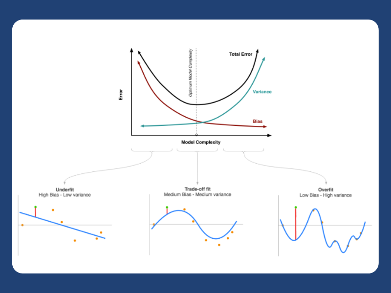
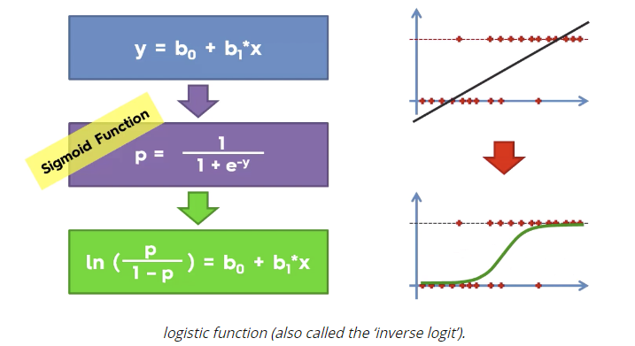
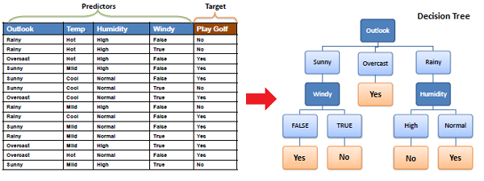
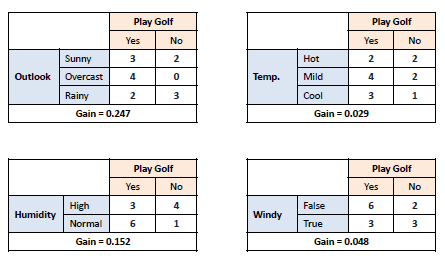

# Table of Contents

1. [General ML Questions](#general-ml-questions)
2. [Feature Selcetion](#feature-selection)
3. [Bias and Variance](#bias-and-variance)
4. [Missing Data](#missing-data)
5. [Supervised and Unsupervised Learning](#supervised-and-unsupervised-learning)
6. [Linear Regression](#linear-regression)
7. [Logistic Regression](#logistic-regression)
8. [Decision Trees](#decision-trees)
9. [Random Forests](#random-forests)
10. [XGBoost](#xgboost)
11. [SVM](#svm)
12. [Naive Bayes](#naive-bayes)
13. [Clustering](#clustering)
14. [Dimensionality Reduction](#dimensionality-reduction)
15. [Association Rule Learning](#association-rule-learning)
16. [Neural Networks](#neural-networks)
17. [Validation and Metrics](#validation-and-metrics)
18. [Discriminative and Generative Models](#discriminative-and-generative-models)
19. [Parametric Models](#parametric-models)
20. [SQL](#sql)
21. [Data Structures](#data-structures)

# General ML Questions

## How do you choose a classifier based on a training set size?

For a small training set, a model with high bias and low variance is better, as it is less likely to overfit. An example is Naive Bayes.

For a large training set, a model with low bias and high variance is better, as it expresses more complex relationships. An example is logistic regression. 

## How do you ensure you are not overfitting a model?

There are three methods we can use to prevent overfitting:
1. Use **cross-validation** techniques.
2. Keep the model **simple** (i.e., take in fewer variables) to reduce variance.
3. Use **regularization techniques** (like LASSO) that penalize model parameters likely to cause overfitting.

## How do hyperparameters and model parameters differ?

A model parameter is a variable that is **internal to the model**. The value of a parameter is estimated from training data. A hyperparameter is a variable that is **external to the model**. The value cannot be estimated from data, and they are commonly used to estimate model parameters.

## What is a Box-Cox transformation?

Transforms the target variable in a way that our data follow the normal distribution. It involves the transformation of any non-linear or power law distribution to a normal distribution. Converting to normal distributions makes it easy to analyze the data based on central tendency of data distribution and we can extract the information from the confidence interval. This in turn enhances the predictive power of the model.

## How do verify this that a model is suffering from multicollinearity and build a better model?

You should create a correlation matrix to identify and remove variables with a correlation above 75%. Keep in mind that this threshold is subjective. 

You could also calculate **VIF (variance inflation favor)** to check.

We can't remove variables, so we should use a penalized regression model or add random noise in the correlated variables, but this approach is less ideal.

## For k-means or kNN, why do we use Euclidean distance over Manhattan distance?

We don't use Manhattan Distance, because it calculates distance horizontally or vertically only. It has dimension restrictions. On the other hand, the Euclidean metric can be used in any space to calculate distance.

# Feature Selection

## How do you select important variables for a dataset?

- Remove correlated variables before selecting important variables.
- Use a RF and plot a variable importance chart.
- Use Lasso regression.
- Use linear regression to select variables based on p-values.
- Use forward selection, stepwise selection, and backward selection.

# Bias and Variance

## What impact do bias and variance in data have on machine learning models?

Bias usually causes ML algorithms to underfit the data. Henceforce, the trained model has high training and testing errors.

Variance usually reuslts in ML algorithms overfitting the data. Therefore, the trained model exhibits a low error in training. However, it is hbound to have a high error in testing.

## Can ML models overcome underfitting on biased data and overfitting on data with variance? Does this guarantee correct results?

Yes, they can. Underfitting can be overcome by utilizing ML models with greater emphasis on the features - increasing the number of features or placing greater weight on the features at play (using higher degree polynomials, for example). As for overfitting, the reverse can be done to eradicate it.

This does not guarantee plausible results in real life since they still may need to be based on data that have not been collected with the proper technique.

## How can you identify a high bias (low variance) model (usually linear models)?

A high bias model is due to a simple model and can simply be identified when the model contains:
- A high training error.
- A validation error or test error that is the same as the training error.

## How can you fix a high bias model?

- Add more input features.
- Add more complexity by introducing polynomial features.
- Decrease the regularization term.

## How can you identify a high variance (low bias) model (usually non-linear models)?

A high variance model is due to a complex model and can simply be identified when the model contains:
- A low training error.
- A validation error or test error that is high.

## How can you fix a high variance model?

- Reduce the input features.
- Reduce the complexity by getting rid of the polynomial features.
- Increase the regularization term.
- We can use a bagging algorithm, which divides a dataset into subsets using randomized sampling. We use those samples to generate a set of models with a single learning algorithm.

## What is the bias and variance tradeoff?

The above tradeoff in complexity is why there is a tradeoff between bias and variance. This means that an algorithm can't be more complex and less complex at the same time since increasing the bias decreases the variance, and increasing the variance decreases the bias. As an example, in k-nearest neighbors, a small k results in predictions with high variance and low bias, whilst a large k results in predictions with a small variance and large bias.

Simple models are stable but highly biased. Complex models are prone to overfitting but express the truth of the model. The optimal reduction of error requires a tradeoff of bias and variance to avoid both high variance and high bias.

## Would it be better if an ML algorithm exhibits a greater amount of bias or a greater amount of variance?

Either one does not have precedence over the other since they both lead to a model that gives inaccurate results, which could cause poor decision-making by the machine or humans at play.

# Missing Data

## Which imputation is better for numerical data with outliers, mean or median? What is the reason behind them?

When an outlier is present in the dataset, median imputation is preferred the most.

## You are given a data set with missing values that spread along 1 standard deviation from the median. What percentage of data would remain unaffected?

The data is spread across the median, so we can assume we're working with a normal distribution. This means that approximately 68% of the data lie at 1 standard deviation from the mean. Therefore, around 32% of the data are unaffected. 

## Your dataset has 50 variables, but 8 variables have missing values higher than 30%. How do you address this?

1. Remove them (not ideal)
2. Assign a unique category to the missing values to see if there is a trend generating this ssue
3. Check distribution with the target variable. If a pattern is found, keep the missing values, assign them to a new category, and remove the others.

# Supervised and Unsupervised Learning

## Explain the difference between supervised and unsupervised machine learning.

**Supervised learning** requires training labeled data. In other words, supervised learning uses a grount truth, meaning we have existing knowledge of our outputs and samples. The goal here is to learn a function that approximates a relationship between inputs and outputs.

**Unsupervised learning**, on the other hand, does not use labeled outputs. The goal here is to infer the natural structure in a dataset.

## What are the most common algorithms for supervised learning and unsupervised learning?
**Supervised learning algorithms:**
- Linear regression
- Logistic regression
- Decision trees
- Random forests
- Naive Bayes
- Neural networks

**Unsupervised algorithms:**
- Clustering: k-Means
- PCA
- t-SNE
- Association rule learning

# Linear Regression

| Pros      | Cons |
| ----------- | ----------- |
| Simple model      | Often too simplistic to model real-world complexity       |
| Computatiionally efficient, fast prediction when large dataset  | Linearity assumption |
| Interpretability of output: Relative influence of one or more predictor variables to the predicted value when the predictors are independent of each other   | Assumes homoskedasticity        |
|               | Severely affected by outliers, since best-fit line tries to minimize the MSE |
|               | Inability to determine feature importance. If we run stochastic linear regression multiple times, the result may be different weights for two features that are highly correlated in the case of multicollinearity. |

## What is linear regression?

In simple terms, linear regression is adopting a linear approach to modeling the relationship between a dependent variable and one or more explanatory variables. In case you have one explanatory variable, you can call it a simple linear regression

## What are the critical assumptions of linear regression?

1. Linear relationship between the dependent and independent variables. A scatter plot can prove handy to check this fact.
2. The explanatory variables should not exhibit multi-collinearity.
3. Homoscedasticity: equal distribution of errors. Heteroscedasticity can be rectified with a log function.
outliers.
## What is the primary difference between R squared and adjusted R squared?

In linear regression, you use both values for model validation. R squared accounts for the variation of all independent variables on the dependent variable. In the case of adjusted R squared, it accounts for the significant variables (p < 0.05) alone for indicating the percentage of variation in the model.

## What is one method of improving a linear regression models?

Outlier treatment, removing outliers. Depending on the distribution, that can be replaced with the mean, median, mode, or percentile.

## How do you interpret a Q-Q plot in a linear regression model?

Plots the quantiles of two distributions with respect to each other. You should concentrate on the y = x line. In case you witness a deviation from this line, one of the distributions could be skewed when compared to the other.

# Logistic Regression

| Pros      | Cons |
| ----------- | ----------- |
| Easy to implement, interpret, and efficient to train.     | Leads to overfitting if number of observations is less than the number of features       |
| No assumptions about distributions of classes in feature space | Constructs linear boundaries |
| Extends to multiple classes (multinomial regression)   | Assumes linearity between dependent and indepedent variables        |
| Provides a measure of how appropriate a predictor (coefficient magnitude) is, but also its direction of association              | Non-linear problems can't be solved with logistic regression because it has a linear decision surface |
| Good accuracy for many simple datasets as it performs well when the dataset is linearly separable              | Requires average or no multicollinearity between independent variables |
| It can interpret model coefficients as indicators of feature importances. | Tough to obtain complex relationships. |
| Can overfit in high-dimensional datasets, but less inclined to overfit. Can be fixed with regularization. | Independent variables should be linearly related to the log odds (log(p / (1 - p)).

## How would you make a prediction using logistic regression?

We are modeling the probability that and input X belongs to the default class Y = 1:

$$
P(X)=P(Y=1|X)
$$

P(X) values are given by the logistic function.

$$
P(X)=\frac{e^{\beta_0 + \beta_1X}}{1 + e^{\beta_0 + \beta_1X}}
$$

The beta_0 and beta_1 values are estimated during the training stage using maximum likelihood estimation or gradient descent. Once we have it, we can make predictions by simply putting numbers into the logistic regression equation and claculating a result.

## When can logistic regression be used?

Logistic regression can be used in classification problems where the output or dependent variable is categorical or binary. However, in order to implement logistic regression correctly, the dataset must also satisfy the following properties:

1. There should not be a high correlation between the explanatory variables. In other words, the predictor variables should be independent of each other.
2. There should be a linear relationship between the logit of the outcome and each predictor variable. The logit function is given as logit(p) = log(p / (1 - p)), where p is the probability of the outcome.
3. The sample size must be large. How large depends on the number of independent variables of the model.

## Why is logistic regression called regression and not classification?

Logistic regression does not actually individually classify things for you: it just gives you probabilities (or log odds ratios in the logit form).

## Compare SVM and logistic regression in handling outliers.

- For logistic regression, outliers can have an unusually large effect on the estimate of logistic regression coefficeints. It will find a linear boundary if it exists to accomodate the outliers. To solve the problem of outliers, sometimes a sigmoid function is used in logistic regression.
- For SVM, outliers can make the decision boundary deviate severly from the optimal hyperplane. One way for SVM to get around the problem is to introduce slack variables. There is a penalty involved with using slack variables, and how SVM handles outliers depends on how this penalty is imposed.

## How is a logistic regression model trained?

The logistic model is trained through the **logistic function**:

$$
P(y)=\frac{1}{1 + e^{-wx}}
$$

P(y) is the probability that the output label belogns to one class. If for some input we got P(y) > 0.5, then the predicted output is 1, and otherwise would be 0. The training is based in estimation of the w vector. For this, in each training instance, we use Stochastic Gradient Descent to clculate a prediction using some initial values of the coefficients, and then claculate new coefficient values based on the error in the previous prediction. The process is repeated for a fixed number of iterations or until the model is accurate enough or cannot be made any more accurate. 

## Provide a mathematical intuition for logistic regression.

Logistic regression can be seen as a transformation from linear regression using the logistic function , also known as the sigmoid function.

$$
S(x) = \frac{1}{1 + e^{-x}}
$$

Given the linear model:

$$
y=b_0 + b_1x
$$

If we apply the sigmoid function to the above equation

$$
S(y) = \frac{1}{1 + e^{-y}}=p
$$

Where p is the probability and it takes values between 0 and 1. If we now apply the logit function to p, it results in:

$$
\text{logit}(p) = \text{log}(\frac{p}{1 - p})=b_0 + b_1x
$$

# Decision Trees

| Pros      | Cons |
| ----------- | ----------- |
| Simple to understand, interpret, and visualize.     | Overfitting: keeps generating new nodes to fit the data, including noisy, making the tree complex to interpret. It is a high variance model |
| Used for both classification and regression | Unstable: Adding new data points can lead to the regeneration of the overall tree. |
| Handles both continuous and categorical variables   | Not suitable for large datasets (should use ensemble techniques instead) |
| No feature scaling required | |
| Handles nonlinear parameters efficiently. | |
| Handles missing values and outliers automatically | |
| Less training period than ensemble techniques | |

## What is the decision tree algorithm?

A decision tree is a supervised ML algorithm that can be used for both regression and classification problem statements. It divides the complete dataset into smaller subsets while, at the same time, an associated decision tree is incrementally developed.

A machine learning model like a decision tree can be easily trained on a dataset by finding the best splits to make at each node. The decision trees' final output is a tree with decision nodes and leaf nodes. A decision tree can operate on both categorical and numerical data.

Unlike deep learning, DTs are very easy to interpret and understand, making them a popular choice for decision-making applications.

## What is the default method for splitting in decision trees?

The default method is the **Gini index**, which is the measure of impurity of a particular node. Essentially, it calculates the probability of a specific feature that is classified incorrectly. When the elements are linked by a single class, we call this "pure". It is preferred because it is not computationally intensive and doesn't involve logarithm function.

## List down some popular algorithms used for deriving Decision Trees and their attribute selection measures.

1. **ID3 (Iterative Dichotomiser)**: Uses Information Gain as an attribute selection measure.
2. **C4.5 (Successor of ID3)**: Uses Gain Ratio as an attribute selection measure.
3. **CART (Classification algorithm and Regression Trees)**: Uses Gini Index as an attribute selection measure.

## Explain the CART Algorithm for Decision Trees.

**Classification Algorithm and Regression Trees** is a greedy algorithm that greedily searches for an optimum split at the top level, then repeats the same process at each of the subsequent levels.

Moreover, it verifies whether the split will lead to the lowest impurity, and the solution provided by the greedy algorithm is not guaranteed to be optimal. It often procues a reasonably good solution since finding the optimal Tree is an NP-Complete problem requiring exponential time complexity.

As a result, it makes problem intractable even for small training sets. This is why we must choose a "reasonably good" solution instead of an optimal one.

## List down the attribute selection measures usde by the ID3 algorithm to construct a Decision Tree.

The mostly widely used algorithm for building a DT is called ID3. ID3 uses entropy and information gain as attribute selection measures to construct a decision tree.

1. **Entropy**: A DT is built top-down from a root node and involves the partitioning of data into homogeneous subsets. To check the homogeneity of a sample, ID3 uses entropy. Therefore, entropy is zero when the sample is completely ghomogeneous, and entropy of one when the sample is equally divided between different classes.
2. **Information Gain**: Information Gain is based on the decrease in entropy after splitting a dataset based on an attribute. The meaning of constructing a DT is all about finding the attributes having the highest information gain.

$$
\text{Gain}(T, X)=\text{Entropy}(T)-\text{Entropy}(T, X)
$$

## Explain the difference between the CART and ID3 algorithms.

The CART algorithm produces only binary trees: non-leaf nodes always have two childrens (questions only have yes/no answers). On the contrary, other tree algorithms can produce DTs with nodes having more than two children.

## Which should be preferred among Gini impurity and Entropy?

Most of the time, it does not make a big difference. Gini impurity is a good default while implementing in `sklearn` since it is slightly faster. However, when they work differently, Gini impurity tends to isolate the most frequent class in its own branch of the tree, while entropy tends to produce slightly more balanced trees.

## What do you understand about Information Gain? Also, explain the mathematical formulation associated with it.

Information gain is the difference between the entropy of a data sement before and after the split, i.e., reduction in impurity due to the selection of an attribute.

Some points to keep in mind about information gain:
- High difference represents high information gain.of children 
- High difference implies the lower entropy of all data segments resulting from the split.
- Thus, the higher the difference, the higher the information gain, and the better the feature used for the split.

Mathematically: Information Gain = E(S1) - E(S2)
- E(S1) denotes the entropy of data belonging to the node before the split.
- E(S2) denotes the weighted summation of entropy of children nodes by considering the weights as the proporation of data instances falling in specific childern nodes.

## Do we require feature scaling for decision trees?

They don't require feature scaling or centering (standardization). Such models are often called **white-box models**. DTs provide simple classification rules based on if and else statements that can even be applied manually if necessary.

## What are the disadvantages of information gain?

Information gain is defined as the reduction in entropy due to the selection of a particular attribute. Information gain biasses the decision tree against considering attrbites with a large number of distinct values, which might lead to overftiting. The **information gain ratio** is used to solve this problem.

## When are decision trees most suitable?
- Tabular data
- Discret outputs
- Explanations for decisions are reuqired
- Training data may contain errors and noisy data (outliers)
- Training data may contain missing feature values

## Explain the time and space complexity of training and testing for decision trees.

Sorting the data in training takes O(nlogn) time, following which we traverse the data points to find the right threshold, which takes O(n) time. Subsequently, for d dimensions, the total complexity would be:

$$
O(n\text{log}n*d) + O(n*d)
$$

Which is asymptotically

$$
O(n\text{log}n*d)
$$

While training the DT,we identify the nodes, which are typically stored in the form of if-else statement, due to which the training space complexity is O(nodes).

The testing time complexity is O(depth) as we have to traverse from the root to a leaf node in the decision tree, so the testing space complexity is O(nodes).

## How does a decision tree handle missing attribute values?

- Fill the missing attribute value with the most common value of that attribute.
- Fill in the missing value by assigning a probability to each of the possible values of the attribute based on other samples.

## How does a decision tree handle continuous features?

Decision Trees handle continuous features by converting features into a threshold-based boolean feature. We use information gain to choose the threshold.

## What is the inductive bias of a decision tree?

The ID3 algorithm prefers shorter trees over longer trees. In decision trees, attributes with high information gain are placed close to the root and are preferred over those without. In the case of decision trees, the depth of the trees is the inductive bias. If the depth of the tree is too low, then there is too much generalization in the model.

## Compare the different attribute selection measures.
1. **Information gain**: Biased towards multivalued attributes.
2. **Gain ratio**: Prefers unbalanced splits in which one data segment is much smaller than the other segment.
3. **Gini index**: Biased to multivalued attributes, has difficulty when the number of classes is too large, and tends to favor tests that result in equal-sized partitions and purity in both partitions.

## Is the Gini Impurity of a node lower or greater than that of its parent? Comment whether it is generally lower/greater or always lower/greater.

A node's Gini impurity is generally lower than that of its parent as the CART training algorithm cost function splits each of the nodes in a way that minimizes the weighted sum of its children's Gini impurities. However, sometimes it is also possible for a node to have a higher Gini impurity than its parent.

## Why do we require pruning in decision trees?

After we create a DT, we observe that most of the time, the leaf nodes have very high homoegeneity, i.e., properly classified data. However, this also leads to overfitting. Moreover, if enough partitioning is not carried out, it would lead to underfitting. Hence, the major challenge is finding the optimal trees that result in the appropriate classification having acceptable accuracy. We first make the DT and use the error rates to prune the trees appropriately. Boosting can also be used to increase the accuracy of the model by combining the predictions of weak learners into a stronger learner.

## Are decision trees affected by outliers?

Decision trees are not sensitive to noisy data or outliers since extreme values or outliers never cause much reduction in the residual sum of squares, because they are never involved in the split. DTs are generally robust to outliers. Due to their tendency to overfit, they are prone to sampling errors. If sampled training data is someon edifferent than evaluation data, then DTs tend not tto produce great results.

## What do you understand by pruning in a DT?

Pruning is the process of removing sub-nodes of a decision tree, and it is the opposite process of splitting. Two types:

**Post-pruning**:
- Used after the construction of the decision tree.
- Used when the DT has a tremedous depth and will show overfitting.
- Also known as backward pruning.
- Used when we have an infinitely grown decision tree.

**Pre-pruning**:
- This technique is used before the construction of the decision tree.
- Pre-pruning done using hyperparameter tuning.

# Random Forests

## What is the random forest algorithm?

Ensemble technique that averages several decision trees on different parts of the same training set, with the objective of overcoming overfitting of individual decision trees. It's used for both classification and regression problem statements that operate by constructing a lot of decision trees at the same time.

# XGBoost

# SVM

## Why does XGBoost perform better than SVM?

XGBoost is an **ensemble method** that uses many trees. This means it improves as it repeats itself.

SVM is a **linear separator**. So, if our data is not linearly separable, SVM requires a kernel to get the data to a state where it can be separated. This can limit us, as there is not a perfect kernel for every given dataset.

# Naive Bayes

| Pros      | Cons |
| ----------- | ----------- |
| Fast, easily predict class of test dataset      | Will assign category in test dataset a probability of 0 if it is not present in the test set. "Zero Frequency" problem, smoothing technique needed to solve.       |
| Supports multi-class predicction   | Assumption of independence        |
| Performs better thna other models with less training data if independence assumption holds   | Known to be a lousy estimator        |
| Performs well on categorical input variables to compared to numeric   | Will rarely find a set of independent features in real life        |

## What is Bayes' Theorem? Why do we use it?

Bayes' Theorem is how we find a probability when we know other probabilities. In other words, it provides the **posterior probability** of a prior knowledge event. This theorem is a principled way of calcultaing conditional probabilities.

In ML, Bayes' theorem is used in a probability framework that fits a model to a training dataset and for building classification predictive modeling problems.

## What are Naive Bayes classifiers? Why do we use them?

Naive Bayes classifiers are a **collection of classification algorithms**. These classifiers are a family of algorithms that share a common principle. NB classifiers assume that the occurrence of absence of a feature does not influence the presence or absence of another feature ("naive" assumption).

When the assumption of independence holds, they are easy to implement and yield better results than other sophisticated predictors. They are used in spam filtering, text analysis, and recommendation systems.

# Clustering

# Dimensionality Reduction

# Association Rule Learning

# Neural Networks

| Pros      | Cons |
| ----------- | ----------- |
| Store data on the entire network      | Requires complex processors       |
| Distributed memory   | Duration of a network is somewhat unknown        |
| Great accuracy even with limited information   | We rely on error value too heavily        |
| Parallel Processing   | Black-box nature        |

## What is the exploding gradient problem when using the back-propagation technique?

In a deep neural network with n hidden layers, n derivatives will be multiplied together while performing back-propagation. If the derivatives are large enough, the gradient increases exponentially as we propagate backwards in the model. This will cause accumulation of large error gradients and they eventually become large in magnitudes. This is called the problem of cexploding gradients, which makes the model unstable by making it difficult to converge to ideal weight value. We can tackle this by reducing the number of layers or by initializing the weight

# Validation and Metrics

| Name      | Description |
| ----------- | ----------- |
| Precision      | TP / (TP + FP), How many of the positive values the model predicted are predicted correctly       |
| Recall  | TP / (TP + FN), How many of the positive samples in the dataset did the model predict correctly   |

## Explain the difference between a Type I and Type II error.

A Type I error is a **false positive** and a Type II error is a **false negative**.

## Explain the ROC Curve and AUC.

The ROC curve is a graphical representation of the performance of a classification mdoel at all thresholds. It has two thresholds: true positive rate and false positive rate. AUC (Area under the ROC curve) is simply, the area under the ROC curve. AUC measures the two-dimensional area underneath the ROC curve from (0, 0) to (1, 1). It is used as a performance metric for evaluating binary classification models.

## What evaluation approaches would you use to gauge the effectiveness of an ML model?

First, split the dataset into training and test sets. You could also use a cross-validation technique to segment the dataset. Then, you would select and implement performance metrics. For example, you could use the confusion matrix, the F1 score, and accuracy.

## What is a confusion matrix? Why do we need it?

The confusion matrix displays the number of true positives, true negatives, false positives, and false negatives for a given model. Each of these values represents the number of times a model has made a correct or incorrect prediction. It allows us to see how well a model is performing by showing us how often it is making correct or incorrect predictions.

## You must evaluate a regression model based on R², adjusted R² and tolerance. What are your criteria?

R^2 and adjusted R^2 should be close together. If they are far apart, the model could be overfitting. Also, the mean of the error terms has to be zero (intercept can always be adjusted to produce 0 mean residuals), and identical and independently distributed. There should be no correlation among the error terms.

# Discriminative and Generative Models

## What is the difference between generative and discriminative models?

A discriminative model learns **distinctions between different categories** of data. A generative model learns **categories of data**. Discriminative models generally perform better on classification tasks.

# Parametric Models

## What are parameteric models? Provide an example.

Parametric models have a **finite number of parameters**. You only need ot know the parameters of the model to make a data prediction. Common examples are as follows: linear SVMs, linear regression, and logistic regression.

Non-parameteric models have **unbounded number of parameters** to offer flexibility. For data predictions, you need the parameters of the model and the state of the observed data. Common examples are as follows: k-nearest neighbors, decision trees, and topic models.

# Time Series

## Which cross-validation technique would you choose for a time series dataset?

A time series is not randomly distributed but has chronological ordering. You want to use something like **forward chaining** so you can model based on past data before looking at future data. For example:

- Fold 1: training set [1], test [2]
- Fold 2: training [1, 2], test [3]
- Fold 3: training [1, 2, 3] test [4]
- Fold 4: training [1, 2, 3, 4], test [5]
- Fold 5: training [1, 2, 3, 4, 5], test [6]

# SQL

## In SQL, how are primary and foreign keys related?

Foreign keys allows you to **match and join tables** on the primary key of the corresponding table.

# Data Structures

## Explain the difference between an array and a linked list.

An array is an **ordered collection** of objects. It assumes that every element has the same size, since the entire array is stored in a contiguous block of memory. The size of an array is specified at the time of declaration and cannot be changed afterward. Search options for an array are linear search and binary search (if it's sorted).

A linked list if a **series of objects** with pointers. Different elements are stored at different memory locations, and data items can be added or removed when desired. The only search option for a linked list is linear.
