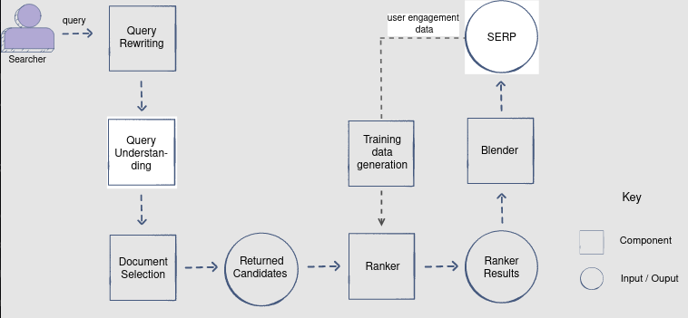

**FIRST** ASK QUESTIONS! The interviewer is supposed to ask a vague question for these.

# Table of Contents

1. [Practical ML Techniques](#practical-ml-techniques)
    1. [Performance and Capacity Consideration](#performance-and-capacity-consideration)
    2. [Considerations in a Large-Scale System](#considerations-in-a-large-scale-system)
    3. [Training Data Collection Strategies](#training-data-collection-strategies)
        1. [User's interaction with pre-existing system (online)](#users-interaction-with-pre-existing-system-online)
        2. [Human labelers (offline)](#human-labelers-offline)
        3. [Train, test, & validation splits](#train-test--validation-splits)
        4. [Training Data Filtering](#training-data-filtering)
    4. [Online Experimentation](#online-experimentation)
        1. [Running an Online Experiment](#running-an-online-experiment)
        2. [Measuring results and computing statistical significance](#measuring-results-and-computing-statistical-significance)
        3. [Long-term effects: Back testing and long-running A/B tests](#long-term-effects-back-testing-and-long-running-ab-tests)
    5. [Embeddings](#embeddings)
        1. [Text Embeddings](#text-embeddings)
            1. [Word2Vec](#word2vec)
            2. [Context-Based Embeddings](#context-based-embeddings)
        2. [Visual Embeddings](#visual-embeddings)
            1. [Auto-Encoders](#auto-encoders)
            2. [Visual supervised learning tasks](#visual-supervised-learning-tasks)
        3. [Learning embeddings for a particular learning task](#learning-embeddings-for-a-particular-learning-task)
        4. [Network/Relationship-based Embedding](#networkrelationship-based-embedding)
    6. [Transfer Learning](#transfer-learning)
        1. [Motivation](#motivation)
        2. [Techniques](#techniques)
        3. [Applications](#applications)
            1. [Computer Vision](#computer-vision)
            2. [NLP](#nlp)
2. [Search Ranking](#search-ranking)
    1. [Problem Statement](#problem-statement)
        1. [Clarifying Questions](#clarifying-questions)
            1. [Problem Scope](#problem-scope)
            2. [Scale](#scale)
            3. [Personalization](#personalization)
    2. [Metrics](#metrics)
        1. [Online Metrics](#online-metrics)
            1. [Click-Through Rate](#click-through-rate)
            2. [Successful Session Rate](#successful-session-rate)
            3. [Caveat](#caveat)
        2. [Offline Metrics](#offline-metrics)
            1. [NDCG](#ndcg)
            2. [Caveat](#caveat)
    3. [Architectural Components](#architectural-components)
        1. [Query Rewriting](#query-rewriting)
        2. [Query Understanding](#query-understanding)
        3. [Document Selection](#document-selection)
        4. [Ranker](#ranker)
        5. [Blender](#blender)
        6. [Training Data Generation](#training-data-generation)
    4. [Document Selection](#document-selection)
        1. [Selection Criteria](#selection-criteria)
        2. [Relevance Scoring Scheme](#relevance-scoring-scheme)
            1. [Terms Match](#terms-match)
    5. [Feature Engineering](#feature-engineering)

## Performance and Capacity Consideration

We need to consider performance and capacity along with optimization for ML task at hand, measure complexity at training and evaluation time. There are three different types of complexities for machine learning algorithms:
- **Training complexity**: Time taken to train the model for a given task.
- **Evaluation complexity**: Time taken to evaluate the input at testing time.
- **Sample complexity**: Total number of training samples required to learn a target function. This changes if the model capacity changes (for a deep neural network, the sample complexity is larger than decision trees and linear regression).

**Training and prediction complexities**:
- **Linear/logistic regression (batch)**: Training time is $O(nfe)$, where $n$ is the number of training samples, $f$ is the number of features, $e$ is the number of epochs. Evaluation time is $O(f)$.
    - Best choice if we want to save time on training and evaluation.
    - Same complexity of a single-layer neural network algorithm.
    - xample: Service level agreement (SLA) for ad prediction system says we need to select the relevant adds from a pool of adds in 300 ms. Given this request, we need a fast algorithm, so linear regression would serve the purpose here.
- **Neural networks**: More time in training and evaluation, and needs more training data. However, can handle more complex tasks such as language understanding and image segmentation. Also can give more accurate predictions in comparison to other models. Training time is exponential as it varies per implementation. The evaluation time is $O(fn_{l_1} + n_{l_1}n_{l_2} + ...)$.
    - Viable choice if capacity isn't a problem and it fits well for a task.
- **MART (Multiple Additive Regression Trees) and tree-based algorithms**: Training time is $O(ndfn_{\text{trees}})$, and evaluation time is $O(fdn_{\text{trees}})$, where $d$ is the max depth.
    - Greater computational cost than linear models, but faster than deep neural networks.
    - Able to generalize well using a moderately-sized dataset.
    - Good choice if training data is limited to a few million examples and capacity/performance is critical.

## Considerations in a Large-Scale System

Example would be a search system getting a query that matches 100 million web pages, and we want our ML system to respond with the most relevant web pages while meeting the constraints outlined in the SLA. Assume the SLA emphasizes performance and cpaacity.
- **Performance** SLA ensures that we return the results back within a given time frame (500 ms, etc.) for 99% of queries.
- **Capacity** SLA refers to the load that our system can handle, i.e., a system that can support 1,000 QPS (queries per second).

Evaluate our document using a relatively fast model (tree-based, linear regression) and it takes 1 $\mu$ s. The model would still take 100 seconds to run for 100 million matched documents $\rightarrow$ **distributed systems**! 

We distribute the load of a single query among **multiple shards** (i.e., among 1,000 machines) $\rightarrow$ 100s/1000, 100 millisecond execution time for our fast model!

If we decide to use a neural network, which won't meet performance SLA even with 1,000 shards, we use a **layered/funnel-based** modeling approach:
- Start with a relatively fast model when we have the most number of documents.
- Increase complexity in later stage and execution time, but with reduced dataset
- Apply neural network for only top 500 documents. If it takes 1 ms per document for evaluation, we would need 500 milliseconds on a single machine. We could divide into five shards for around 100 ms.

Example for ad prediction: ad selection through logistic regression, then ad prediction through neural network.

## Training Data Collection Strategies

### User's interaction with pre-existing system (online)

- Relevance or ranking early versions is a rule-based system, off of which we can build the ML system
- ML system can utilize user's interaction with pre-existing system to generate training data for new model
- Need *positive* examples (Example would be a search system getting a query that matches 100 million web pages, and we want our ML system to respond with the most relevant web pages while meeting the constraints outlined in the SLA. Assume the SLA emphasizes performance and capacity.

### Human labelers (offline)

- Someone in a self-driving car cannot generate the training data as they are not interacting with the system in a a way that would give segmentation labels for the images captured by the car camera.
- **Crowdsourcing**:
    - Outsource a task to a large group of people, sites such as Amazon Mechanical Turk
    - For simple tasks, flagging an email as spam or real requires no special training for the crowd workers
    - Can't use if we have privacy concerns, or need specialized training

- **Specialized labelers**:
    - Trained labelers who know how to use Label box software to segment images taken by car
    - Training can be costly and time-consuming.

- **Open-source datasets**
- Also can build the product in a way that it collects data from the user. User can name interests (user profile), boards they want to save (content profile)
- Data expansion using GANs

### Train, test, & validation splits

Want to perform hyperparameter tuning on the validation set, not training set (testing performance of a model on the same data it was trained on would not give a good estimation of model's generalization abilities).

For the test data, the outcome on this prat will allow us to make the final choice for model selection. If we had trained several models, we can then further see if their performance poost is significant enough to call for an online A/B test. We can't use the validation here as it still impacted the model hyperparameters. 

How might we split the data for a movie recommender system? We usually want to forecast future recommendations, so we might want some time features (i.e., user interaction patterns might differ throughout the week). We could train the model on data from one time interval and validate/test from its succeeding time interval.

The quantity of the training data depends on the modeling technique. We can plot the model's performance against the number of training samples to see where there is no longer a gain in the model's performance.

### Training Data Filtering

- Cleaning data
    - Missing data, outliers, duplicates, dropping out irrelevant features.
    - Identify patterns that may not be useful for the tasks! Example: For a search engine dataset, get rid of bot traffic apart from real users. Bot traffic would contain impressions and no clicks on a search result, and would result in a lot of false negatives. 

- Removing bias
    - Bias example: Netflix movie recommender showing recommendations based on popularity, so popular movies always appear first, and better movies are shown later if they are newer and don't show a lot of user engagement. The user would then never interact with these newer, better movies.
    - Hence, the model will keep considering the top recommendations to be the popular movies time and time again. 
    - We need to diversify the recommendations, employing an exploration technique that explores the whole content pool

- Bootstrapping new items
    - If new items are added frequently, the new items may not garner a lot of attention, so we need to boost them to increase their visibility. In movie recommendation systems, new movies face the "cold start problem".
    - Recommend new movies based on their similarity to the user's already watched movies. 

## Online Experimentation

### Running an Online Experiment

There are many ways to gauge success. The success of an advertising platform can be measured using the user's engagement rate with the advertisement and the overall revenue generated by the system. A search ranking system might take into account correctly ranked search results as a metric. 

- Example hypothesis: Does an increase in the neural network depth or width (increase in activation units) increase latency and capacity but still have an overall positive impact on engagement and net ad revenue?
- Do we deploy the next version of the ML system to the production environment? What if the hypothesis intuition is wrong and the mistake becomes costly?
- **A/B testing** useful for seeing impact of new features or changes in system on user experience
    - Two versions of a webpage or app compared
    - Webpage or app screen is modified to create a second version of the same page
    - $H_0$: Design change will not have an effect on variation. If we fail to reject the null hypothesis, we should not launch the new feature.
    - $H_{\text{alternative}}$: Design change will have an impact on variation. Variation will go into production if we reject the null hypothesis.
    - **Task**: Determine if the number of successes in the variant is significantly higher than the control. Before analyzing the results, conduct a poewr analysis test to determine how much overall traffic should be given to the system, i.e., the minimum sample size required to see the impact of conversion.
    - Send half to the control, half to the variation

### Measuring results and computing statistical significance

If an A/B test is run with the outcome of a significance level of 95\%, ($p \leq 0.05$), there is a 5\% probability that the variation we see is by chance. 

### Long-term effects: Back testing and long-running A/B tests

In some cases, we need to be more confident about the result of an A/B experiment when it is overly optimistic.
- Say overall system performance improves by 5% instead of the expected 2%.
- We can confirm whether we are overconfident, and perform a **backtest**. System A is the previous system B, and vice versa, so we are swapping the control and variation.
- Check if we lose gains. Is the gain caused by an A/B experiment equal to the loss by B/A experiment? If so, the changes made in the system improved performance.

Sometimes, A/B tests can run for a too short period of time, resulting in a “false negative” impact.
- Example: Ad prediction system, revenue goes up by 5% when we started showing more ads to users, but no effect on user retention. Users might start leaving the platform if we show them significantly more ads over a longer period of time.
- To understand this impact, we could have a long-running A/B experiment to understand the impact. This can also be done via a backtest. 

## Embeddings

Capture semantic information in a low-dimensional vector space via encoding. This can help identify related entities in the vector space. Embeddings are usually generated with neural networks.
- Example: Word2Vec of Wiki data and using them as spam-filtering models. 
- Example: Twitter can build an embedding for their users based on their organic feed interactions.

### Text Embeddings

#### Word2Vec
- Word2Vec generates embeddings with a shallow neural network (single hidden layer)
- Self-supervised: trains a model by predicting words from other words that appear in the sentence.
- Represents words with a dense vector, uses neighboring words to predict the current word and in the process, generates word embeddings.
- Two networks generate these embeddings:
    - **CBOW**: Continuous bag of words predicts current word from surrounding words by optimizing

$$
\text{Loss}=-\text{log}(p(w_t|w_{t-n},...w_{t-1},w_{t+1},w_{t+n}))
$$

- $n$ is the window size. It uses the entire contextual information as one observation while training the network.
- **Skipgram**: Predicts surrounding words from the current word. Optimizes

$$
\text{Loss}=-\text{log}(p(w_{t-n},...w_{t-1},w_{t+1},w_{t+n}|w_t))
$$

- Example: Predict whether a user is interested in a particular document given the documents that they have previously read.
    - Represent the user by taking the mean of the Word2Vec embeddings of document titles.
    - Represent the document by the mean of its title term embeddings.
    - Use the dot product between these two vectors in our ML model, or simply pass the user and document embedding vector to a neural network.

#### Context-Based Embeddings

- Word2Vec embeddings have a fixed vector, so don't take into account the context. Don't distinguish between “I'd like to eat an apple” and “Apple makes great products”, meaning doesn't change with Word2Vec.
- Context-based embeddings look at neighboring terms at embedding generation time.
- Two popular architectures to generate word context-based embeddings:
    - **Embeddings from Language Models (ELMo)**: Bidirectional LSTM model to capture words before and after
    - **Bidirectional Encoder Representations from Transformers (BERT)**: Uses an attention mechanism to see all the words in the context and use only the ones that help with prediction

### Visual Embeddings

#### Auto-Encoders

- Encoder compresses raw image pixel data into lower dimension
- Decoder regenerates the same input image from low-dimensional data, last layer of encoder determines dimension of the embedding
- Embedding dimension should be sufficiently large for decoder to capture enough information to reconstruct
- Encoder and decoder jointly minimize difference between original and generated pixels, using backpropagation to train
- After training the model, we use only the encoder to generate image embeddings.
- Self-supervised: Uses image dataset without any label

#### Visual supervised learning tasks

- Tasks would be object detection, image classification. Set up with convolution, FC, pooling layers, softmax/final classification layers.
- Example, VGG16 architecture embedding
- Example case: Find images similar to a given image
- Example case: Image search problem where we want to find the best images for given text terms, i.e., query “cats”. Use query term embedding and image embedding.

### Learning embeddings for a particular learning task

Example: predict whether a user will watch a particular movie based on their historical interactions. Here, utilizing movies that the user watched as well as their prior search terms can be beneficial. We can embed a sparse vector of movies and terms in the network itself.

### Network/Relationship-based Embedding

Systems usually have multiple entities that interact with each other. These would be a graph/set of interaction pairs.

- Retrieval and ranking of results for a particular user are mostly about predicting how close they are.
- Have an embedding model that projects these documents in the same embedding space can help in retrieval and ranking of tasks for recommendation, search, feed, etc.
- Can generate embeddings for both of the above pairs of entities in the same space by creating a two-tower neural network model that encodes each item using their raw features.
    - Optimize the inner product loss such that positive pairs from interactions have a higher score and random pairs have a lower score.

## Transfer Learning

### Motivation

1. **Growth in the ML community and knowledge sharing**: Strong desire to share state-of-the-art-models and datasets in the community.
2. **Common sub-problems**: For example, in all visual understanding nad prediction areas, tasks such as finding edges, boundaries, and background are common sub-problems. In text domain, semantic understanding of textual terms can be helpful in almost all problems where the user is represented by text terms (recommendation, search, ads)
3. **Limited supervised learning data and training resources**
    - Limited amount of training data available for models to generalize well. In transfer learning, we have the ability to start learning from pre-trained models, so we can utilize the knowledge from similar domains
    - Self-supervised learning models utilize massive available datasets for text and image representation, Word2Vec embedding models don't need any manual labels and can use books and Wikipedia data to build a semantic understanding
    - Transfer learning optimizes training resources. Google can train a BERT model on billions of examples with massive computing power, but others are going to find it challenging to train similar optimized models. Don't have to reinvest those resources, instead plug in the output of the BERT model and use it as sub-model in training process

### Techniques
- **Extract features from useful layers**. Keep the initial layers of the pre-trained model and remove the final layers. Add the new layer to keep the remaining chunk and train them for final classification.
- **Fine-tuning**. Change or tune existing parameters in a pre-trained network, optimizing the model parameters during training for supervised prediction task. See how many layers can we freeze and how many final layers we want to fine-tune, requires understanding of the model architecture.

Techniques depend on a couple factors:
1. **Size of our supervised training dataset**
    - *Limited training data*: Either freeze all layers and using the pret-trained model for feature generation, or fine-tuning only the final layers.
    - *Plenty of training data*: More ideas to play around with. Start with just freeing the model, fine-tuning only final layers, or we can retrain the whole model to adjust the weights for our specialized task.
2. **Similarity of prediction tasks**
    - If we built a classifier for cars and now we want to use it for trucks, there is a good chance that many of the features are going to be common and we don't have to fine-tune much. We can utilize the pre-trained model as it is and build our models on top of it.

### Applications

#### Computer Vision

**Example**: Classifier for medical imaging data, 100k manual labelled examples. We can pick one pre-trained ImageNet classifier and start building on top of it. Hierarchy of a trained convolutional network:
- Filters of first layer often detect edges or blocks of color
- Second can detect features like shape

**Case 1: Fine-tuning a few layers**
If our prediction task is similar, there will be similar higher-level features or layers output. Therefore, we can *freeze the weight of most of the starting layers* of the pre-trained model and fine-tune only the end layers. We would finetune only the end FC + ReLU layers

**Case 2: Fine-tuning more layers**
If we have a significant amount of labelled examples and our learning tasks have commonalities but few differences as well, it would make sense to go deeper in finetuning our pre-trained model. We will *freeze the weights of the first few layers* and fine-tune the weights of the remaining end layers to optimize the model for our new learning task on medical image dataset.

**Case 3: Fine-tuning the entire model**
If the new dataset is larger, then we load the weights of the pre-trained model and *fine-tune the entire network*. This will increase our training time but should help us optimize our learning task when we have significant training data.

#### NLP

Need to generate the *dense representation* of textual terms. A few of the popular term representation models that use a self-supervised learning approach, trained on massive datasets are Word2Vec, BERT, and ELMO. The term representation based on hese models capture their semantic meanings. Hence, we can transfer knowledge from this learned task in many of the NLP tasks.

We can utilize these embeddings in a NER classifier, spam detector classifier, search ranking, language understanding, etc., and can improve the quality of these ML models.

# Search Ranking

## Problem Statement

The interviewer has asked you to design a search relevance system for a search engine.

### Clarifying Questions

Clarify the problem statement by specifying three aspects:  **scope**, **scale**, and **personalization**

#### Problem Scope

> Is it a general search engine like Google or Bing or a specialized search engine like Amazon products search?

We are narrowing down the problem scope. For now, assume we are working on finding relevant search results like Google or Bing search, but the techniques apply to all search engine. Problem statement can be described as:

> Build a generic search engine that returns relevant results for queries like "Richard Nixon", "programming languages", etc.

This will require us to build a MLM system that provides the most relevant results for a search query by ranking them in order of relevance. This is the **search ranking problem**.

#### Scale

Questions for scale:
- How many websites exist that you want to enable through this search engine?
- How many requests per second do you anticipate to handle?

We will assume that we have billions of documents to search from, and the search engine is getting around 10K QPS (queries per second).

#### Personalization

> Is the searcher a logged-in user or not?

This will define the level of personalization that we can incorporate to improve the relevance of our results. Assume the user is logged in and we have access to their profile and historical searched data.

## Metrics

Selecting the wrong metric could result in the model becoming optimized for a completely wrong criterion. Two types of metrics to evaluate the success of a search query:
1. Online metrics
2. Offline metrics

### Online Metrics

Base the success of a search session on *user actions*. On a per-query level, we could define success as the user action of *clicking on a result*.

#### Click-Through Rate

$$
\text{Click-through-rate} = \frac{\text{Number of clicks}}{\text{Number of impressions}}
$$

An impression means a view. For example, when a search engine result page loads and the user has seen the result, you will consider that as an impression. A click on that result is your success.

#### Successful Session Rate

We can't judge with the click-through rate alone, because unsuccessful clicks can be counted towards a search success. This might include short clicks where the searcher only looked at the resultant document and clicked back immediately. We could solve this issue by filtering our data to only successful clicks, or considering clicks that have a long dwell time.

**Dwell time** is the length of time a searcher spends viewing a webpage after they've clicked a link on a search engine result page.

So, the session success rate is

$$
\text{Session success rate} = \frac{\text{no. of successful session}}{\text{no. of total sessions}}
$$

#### Caveat

**Zero-click searched**: A search engine may answer the searcher's query right at the top such that the searcher doesn't need any further clicks to complete the search. Click-through rate would not work in this case (but should still be included in the definition of a successful session)

**Time to success**

A search session can span over more than one query. 
- A search for "Italian food" can turn into a search for "Italian restaurants". So, the searcher would have to go over multiple results.

For scenarios like this, a *low number of queries per session* means that your system was good at guessing what the searcher actually wanted despite their poorly worded query. 
- So, in this case, we would consider a *low number of queries per session* in our definition of a successful search session.

## Offline Metrics

Makes use of trained human raters: they are asked to rate the relevance of the query results objectively, keeping in view well-defined guidelines. The ratings aggregated across a query sample serve as the *ground truth*.

### NDCG

**Normalized discounted cummulative gain** is a critical evaluation metric for any ranking problem. It's an improvement of of *cumulative gain*.

$$
CG_p=\sum_{i=1}^{p}\text{relevance of document} i
$$

- Documents $D_1$ up to $D_4$ have the following ratings from a rater: $3, 2, 3, 0$, so $CG_4=3+2+3+0=8$
- *Discounted cumulative gain*: penalize ranking if grounth truth relevant documents lower in result list

$$
DCG_p=\sum_{i=1}^p \frac{\text{relevance}_i}{\text{log}_2(i+1)}
$$

- $DCG_4=3+1.262+1.5+0=5.762$
- Denominator penalizes search engine for ranking more useful $D_3$ later
- Then normalize for list length

$$
NDCG_p=\frac{DCG_p}{\text{Ideal} DCG_p}
$$

- Ideal calculated from human-made ranking
- Then NDCG will give range in 0 to 1, where closer to 1 is better performance
- For multiple queries:

$$
NDCG=\frac{\sum_{i=1}^{N} NDCG_i}{N}
$$

### Caveat
Doesn't penalize irrelevant search results, i.e., didn't penalize $D_4$ above
- Remedy is human rater assigning negative relevance score to that document

## Architectural Components

### Query Rewriting
- Poorly worded queries
- This will maximize recall (more relevant search results)
- Spell checker, query expansion ("Italian restaurant" $\rightarrow$ "Italian food, recipes" ) or query relaxation ("good Italian food" $\rightarrow$ "Italian food")

### Query Understanding
- Find out intent: "gas station" is local intent, "earthquake" is news intent, could be a feature

### Document Selection
- Millions of documents are relevant to "sports"
- More focused on recall, uses simpler technique to sift through billions of documents (more on this later)
- Documents go through additional screening, ranking component has reduced workload, so more complex modeling options with greater precision

### Ranker
- ML to find the best order of documents = "learning to rank"
- Large amount of documents returned from document selection stage (>10k), amount of incoming traffic is huge (>10k QPS) $\rightarrow$ multiple stages of ranking
    - Stage 1, for say, 100k documents, is nanoseconds-fast linear model
    - Stage 2, deep learning, to find optimized order of top 500 given by stage one

### Blender
- Relevant results from search vertical like images, videos, news, local results, blog posts
- Satisfies searcher and engages them by making results more relevant
- Want to diversify results as well

### Training Data Generation
- Cyclic manner of ML system: takes online user engagement data from SERP displayed in response to queries and generates positive and negative training examples
- Feed training data to ML models trained for ranking

## Document Selection
> 100 billion documents on the web $\rightarrow$ 100k documents selected related to the query

First, query expansion. Match the term "Italian", and match the term "restauraunt" OR "food"

### Selection Criteria
- All documents/terms stored in **index**, which is a mapping of the words to the list of documents they appear in
- This could calculate the relevance score alongside checking if each document matches criteria at all
- Will have selected relevant documents sorted according to relevance score

### Relevance Scoring Scheme
- **Weighted linear combination** of different factors:
    - Terms match (maybe with 0.5 weight)
    - Document popularity (0.125)
    - Query intent match (0.125)
    - Personalization match (0.125)
- Weights decided through intuition or can be decided by ML (done in the ranking stage)

#### Terms Match
Use **IDF score**, or **inverse document frequency** to weigh the match
- Match for important terms in the query weighs higher

$$
IDF=\text{log}_2\frac{N}{DF}
$$

where $DF$ is the number of documents in which the term appears, so from this, term match for "IItalian" may have more weight

## Feature Engineering

> **Four actors for search**
> 1. Searcher
> 2. Query
> 3. Document
> 4. Context (i.e., search history, age, gender, location, previous queries)

### Searcher-Specific Features
Age, gender, interests can be features
- **Gender-based**: Search for "clothing brands" $\rightarrow$ has searcher shown previous interest in *male* or *female* clothing?
- **Interest-based**: Search for "shooting" $\rightarrow$ has searcher shown previous interest in shooting for photography or arcade shooting?

### Query-Specific Features
**Query historical engagement**
- *Prior* engagement can be feature
- Search "earthquake", historical data suggests it's a news component b/c most people who searched for it wanted news about recent earthquakes

**Query intent**
- Use this feature to assign higher rank to documents that match query'y intent
- "Pizza places" search $\rightarrow$ intent is *local*, will get it from **query understanding component**

### Document-Specific Features

**Page rank**
- Rank of document
- Estimate this by looking at number and quality of documents that link to it

**Document engagement radius**
- Document on coffee shop in Seattle would be more relevant to people living within ten-mile radius
- Document on Eiffel Tower might interest people all over the world
- *local scope of appeal* vs. *global scope of appeal*

### Context-Specific Features

- **Time of search**, time of day, so the model can display restaurants open at that hour
- **Recent events**, useful when querying a location such as "Vancouver"
    - From previous queries: If user searches "go", do we want to show the programming language Go or definition of the word "go"? If they searched for "C++ coding" before, probably the "Go" programming language

### Searcher-Document Features
Consider both the searcher and the document
- Ditsance between searcher and matching locations
- User's historical engagement with the *result type* of the document, important if user tries to "re-find" the document

### Query-Document Features

**Text match**
- In *title* and *metadata* or *content* of document

