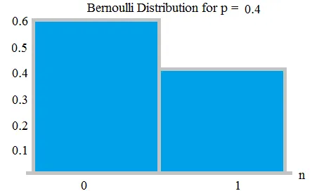
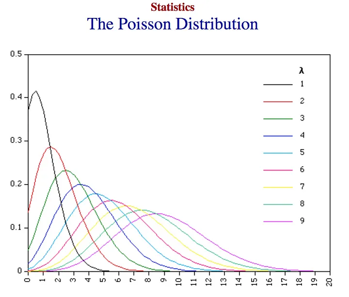

# Table of Contents

1. [Random Variables](#random-variables)
2. [Probability Distributions](#probability-distributions)
    1. [Normal](#normal)
    2. [Bernoulli](#bernoulli)
    3. [Poisson](#poisson)
    4. [Binomial](#binomial)
    5. [Exponential](#exponential)
3. [Maximum Likelihood](#maximum-likelihood)
    1. [Linear Regression](#linear-regression)
    2. [Logistic Regression](#logistic-regression)
4. [Linear Algebra](#linear-algebra)
    1. [Eigenvalues and Eigenvectors](#eigenvalues-and-eigenvectors)
    2. [Decomposition](#decomposition)
5. [Bias-Variance Tradeoff](#bias-variance-tradeoff)
6. [Linear Regression](#linear-regression)
7. [Dimensionality Reduction](#dimensionality-reduction)
    1. [PCA](#pca)
8. [Classification](#classification)
9. [Logistic Regression](#logistic-regression)
10. [Linear Discriminant Analysis](#linear-discriminant-analysis)
    1. [Training Decision Trees](#training-decision-trees)
    2. [Entropy](#entropy)
    3. [Random Forests](#random-forests)
11. [Clustering]
    1. [Overview of Clustering](#overview-of-clustering)
    2. [K-Means Clustering](#k-means-clustering)
    3. [Gaussian Mixture Model](#gaussian-mixture-model)
    4. [Expectation Maximization](#expectation-maximization)

# Random Variables
Quantity with an associated probability distribution: discrete (probability mass function) or continuous (probability density function)

Discrete:

$$
\sum_{x\in X}p(x)=1
$$

Continuous:

$$
\int_{-\infty}^{\infty} p(x)dx=1
$$

**Cumulative distribution function**

$$
F(x)=p(X\leq x)
$$

**Expectation (average value)**

$$
E\[X\]=\int_{-\infty}^{\infty} xp(x)dx
$$

**Variance**

$$
Var(X)=E\[(X-E\[X\])^2\]=E\[X^2\]-E\[X^2\]
$$

**Covariance**

For any given random variables X and Y, the covariance, a linear measure of relationship, is defined by:

$$
Cov(X)=E\[(X-E\[X\])(Y-E\[Y\])\]=E\[XY\]-E\[X\]E\[Y\]
$$

**Correlation**

The normalized covariance between X and Y:

$$
\rho(X,Y)=\frac{Cov(X,Y)}{\sqrt{Var(X)Var(Y)}}
$$

# Probability Distributions

One general method for fitting the parameters (mean and variance, in this case): MLE. The goal in MLE is to estimate the most likely parameters given a likelihood function.

$$
\theta_{\text{MLE}} = \text{argmax}_{\theta}L(\theta), L(\theta)=p(x_1,...,x_n|\theta)
$$

The values of X are assumed to be i.i.d, so the likelihood function becomes:

$$
L(\theta)=\prod_{i=1}^{n}p(x_i|\theta)
$$

Take the log so that is monotonically increasing:

$$
\text{log}L(\theta)=\sum_{i=1}^{n}\text{log}p(x_i|\theta)
$$

We would maximize this with an optimization algorithm like gradient descent. Another way is maximum a posteriori estimation (MAP), which assumes a prior distribution.

$$
\theta_{\text{MAP}} = \text{argmax}_{\theta}p(\theta)p(x_1,...,x_n|\theta)
$$

MAP comes up in a Bayesian setting, since we have priors for the parameters. On the other hand, MLE is frequentist, meaning the likelihood will speak for itself. 

## Normal

Normal distribution, probability density for single variable:

$$
p(x|\mu, \sigma^2)=\frac{1}{\sqrt{2\pi\sigma^2}}\text{exp}-\left(\frac{(x-\mu)^2}{2\sigma^2}\right)
$$

**MLE derivation** (and links to other distributions/problems): https://www.statlect.com/fundamentals-of-statistics/normal-distribution-maximum-likelihood

## Bernoulli

When there is a tossing of a coin, we think of Bernoulli's distribution. p would be the probability of the coin landing on heads or tails, respectively. The outcome of the experiment is boolean in nature.

Probability mass function:

$$
f(k;p) = \begin{cases} 
            p & k=1 \\
            1-p & k=0
         \end{cases}
$$

**MLE derivation**: https://stats.stackexchange.com/questions/275380/maximum-likelihood-estimation-for-bernoulli-distribution

## Poisson

How would you model the count of customers clicking a particular link on your website each minute? The entire number of clicks in one day are modelled by a Poisson distribution. Poisson distributions are applicable in situations where events occur at random bursts of time and space and our interest lies only in the total nnumber of occurrences of the event. Where the rate of occurrence of some event, \lambda, is small, the range of likely possibilities will lie near the zero line. As the rate becomes higher (occurrences of the event become more common), the cneter of the curve moves toward the right. 

**PDF**:

$$
f(k;\lambda) = \frac{e^{-\lambda}\lambda^k}{k!} \qquad k = 0,1,2,\ldots
$$

k is the number of events in the time interval.

**MLE derivation**: https://math.stackexchange.com/questions/2399613/how-to-derive-the-likelihood-and-loglikelihood-of-the-poisson-distribution

## Binomial

Summation of outcomes of a Bernoulli's distribution is a binomial distribution. When you toss a coin more than once and want to map the outcome, we use this distribution. When tossing the coin n times, count is an outcome that follows the binomial distribution. Its parameters are n, the number of trials, and p, the probability of success. The flip is a Bernoulli's trial, and each flip is independent. 

**PDF**:

$$
f(k;n,p) = \begin{cases}
             \binom{n}{k} p^k (1-p)^{n-k} & k = 0,1,\ldots,n \\
             0 & \text{otherwise}
           \end{cases}
$$

**MLE derivation**: https://stats.stackexchange.com/questions/181035/how-to-derive-the-likelihood-function-for-binomial-distribution-for-parameter-es

## Exponential

There is a srtong relationship between the Poisson distribution and the exponential distribution. For example, let's say a Poisson distribution models the number file requests on a server in a day. The time in between each file request can be modeled with an exponential dsitribution. The exponential distribution is mostly used for testing product reliability. Poisson's "How many events per time?" in an experiment relates to the exponential's "How long until an event?". 

**PDF**:

$$
f(x;\lambda) = \begin{cases} 
                  \lambda e^{-\lambda x} & x \geq 0 \\
                  0 & x < 0
               \end{cases}
$$

**CDF**:

$$
F(x;\lambda) = \begin{cases} 
                  1-e^{-\lambda x} & x \geq 0 \\
                  0 & x < 0
               \end{cases}
$$

**MLE derivation**: https://math.stackexchange.com/questions/101481/calculating-maximum-likelihood-estimation-of-the-exponential-distribution-and-pr

# Maximum Likelihood

## Linear Regression

The objective is to estimate the parameters:

$$
y_i=x_i\beta_0+\epsilon_i
$$

x_i is a 1 x K vector of regressors, and \beta_0 is the K x 1 vector of regression coefficients to be estimates. The sample is made up of N i.i.d. observations (y_i, x_i). The regression can be written in matrix form as:

$$
y = X\beta_0+\epsilon
$$

y is the N x 1 vector of observations and the N x K matrix of regressors is denoted by X, and the N x 1 vector of error terms is denoted by /epsilon.

**Assumptions**

The vector of errors has a multivariate normal distribution conditional on X, with the mean equal to 0 and the coariance matrix equal to:

$$
\sigma_0^2I, \sigma_0^2=Var\[\epsilon_i|X\]
$$

\sigma_0^2 is the second parameter to be estimated. It is assumed that the matrix of regressors is full rank.

**Likelihood function**

$$
L(\beta, \sigma^2; y, X)=(2\pi\sigma^2)^{-N/2}\text{exp}\left(-\frac{1}{2\sigma^2}\sum_{i=1}^{N}(y_i-x_i\beta)^2\right)
$$

This comes from:

$$
L(\beta, \sigma^2;y, X)=\prod_{i=1}^{N}f_Y(y_i|X;\beta,\sigma^2)
= \prod_{i=1}^{N}(2\pi\sigma^2)^{-1/2}\text{exp}\left(-\frac{1}{2}\frac{(y_i-x_i\beta)^2}{\sigma^2}\right)
$$

**Log-likelihood function**

$$
l(\beta,\sigma^2;y,X)=-\frac{N}{2}\text{ln}(2\pi)-\frac{N}{2}\text{ln}(\sigma^2)-\frac{1}{2\sigma^2}\sum_{i=1}^{N}(y_i-x_i\beta)^2
$$

**Maximum likelihood estimators**

$$
\hat{\beta_N} = (X^TX)^{-1}X^Ty
$$

$$
\hat{\sigma_N^2} = \frac{1}{N}\sum_{i=1}^{N}(y_i-x_i\hat{\beta_N})^2
$$

More steps: https://www.statlect.com/fundamentals-of-statistics/linear-regression-maximum-likelihood

## Logistic Regression

In the logit model, the output variable y_i is a Bernoulli random variable and 

$$
P(y_i=1|x_i)=S(x_i\beta)
$$

where

$$
S(t)=\frac{1}{1+\text{exp}(-t)}
$$

is the logistic function, x_i is a 1 x K vector of inputs and \beta is a K x 1 vector of coefficients. Furthermore,

$$
P(y_i=0|x_i)=1-S(x_i\beta)
$$

We assume the estimation is carried out with an IID sample comprising N data points, and the vector of coefficients \beta is the parameter to be estimated.

**Likelihood function**

$$
L(\beta;y,X)=\prod_{i=1}^{n}\[S(x_i\beta)\]^{y_i}\[1-S(x_i\beta)\]^{1-y_i}
$$

**Log-likelihood function**

$$
l(\beta;y,X) = \sum_{i=1}^{N}\[-\text{ln}(1+\text{exp}(x_i\beta))+y_ix_i\beta\]
$$

There is no analytical solution of this maximization problem and the solution must be found numerically. The maximization problem is also not guaranteed to have a solution because some situations can arise where the log-likelihood is an unbounded function of the parameters. In these situations, the log-likelihood can be made as large as desired by appropriately choosing \beta. 

# Linear Algebra

## Eigenvalues and Eigenvectors

For some square matrix A, we have a vector x is an eigenvector of A if:

$$
Ax = \lambda x
$$

Since a matrix is a linear transformation, eigenvectors are cases whereby the resulting transformation of the matrix on the vector results in the same direction as before, but with some scaling factor (the eigenvalues).

## Decomposition

The decomposition of a square matrix into its eigenvectors is called an eigendecomposition. Note that while not all matrices are square, through SVD, every matrix has a decomposition:

$$
A=U\Sigma V^T
$$

# Bias-Variance Tradeoff

With any model, we generally are trying to estimate a true underlying:

$$
y=f(x)+w
$$

To assess how well the model fits, we can decompose the error of y as the following:
1. Bias (how well the values come close to the true f(x) values)
2. Variance (how much the prediction changes based on training inputs)
3. Irreducible error (due to inherently noisy observation processes)

There is a tradeoff between bias and variance, and this is a useful framework for thinking about how different models. The overall goal is to control overfitting. The equation of the tradeoff can be expressed by: Total model error = Bias + Variance + Irreducible error

# Linear Regression

The goal is to estimate y = f(x) of the following form.

$$
y = X\beta
$$

where X is a matrix of data points and \beta is the vector of weights. In the least-squares context, linear regression minimizes the residual sum of squares, which is given by:

$$
RSS(\beta) = (y-X\beta)^T(y-X\beta)
$$

In regression, one can use MLE to estimate the \beta values by using a multivariate Gaussian (see above):

$$
Y \tilde N(X\beta, \sigma^2I)
$$

which leads to results that are the same as minimizing the RSS. **For a MAP context, there can be priors for \beta, of which leads to Ridge Regression, which penalizes the weights to prevent overfitting.** In Ridge regression, the objective function becomes minimize:

$$
(y-X\beta)^T(y-X\beta)+\lambda|\beta|_2^2
$$

# Dimensionality Reduction

## PCA

Decomposing data  into a smaller set of variables is very useful for summarizing and visualizing data. One common method of dimensionality reduction is PCA, which reconstructs data into a lower dimensional setting. It looks for a small number of linear combinations of a p-dimensional vector x to explain the variance within x. We want to find the vector of weights such that we can define the following linear combination:

$$
y_i=w_i^Tx=\sum_{j=1}{p}w_{ij}x_j
$$

subject to the following:

$$
y_i \text{is uncorrelated with} y_j, var(y_i) \text{is maximized}
$$

Hence, we have the procedural description where first we find the first component with maximal variance, and then the second that is uncorrelated with the first, and continue this procedure iteratively. The idea is to end with k dimensions such that

$$
y_1,...,y_k \text{explain the majority of the variance}, k << p
$$

The final result is an eigendecomposition of the covariance matrix of X, whereby the first principal component is the eigenvector corresponding to the largest eigenvalue, and so on.

# Classification

The goal of classification is to assign a given data point to one of K classes, instead of a continuous scale. The first type of classification model is **generative**, which models the joint probability distribution between X and Y. That is, for an input X, we want to classify an arbitrary data point x with the following class label:

$$
\hat{y} = \text{argmax}_kp(x,Y=k)
$$

The joint probability distribution between X and Y is given by:

$$
p(X,Y)=p(Y|X)p(X)
$$

for each given class k we have:

$$
p_k(X)=p(X|k)p(k)
$$

such that:

$$
\hat{y}=\text{argmax}_kp(Y=k|x)
$$

The result of **maximizing the posterior means there will be a decision boundary between classes where the posterior probability is equal**. 

The second type of classification is **discriminative**, which directly learns a decision boundary by choosing a class that maximizes the posterior probability distribution:

$$
\hat{y}=\text{argmax}_kp(Y=k|x)
$$

So both methods end up choosing a predicted class that maximize the posterior probability distribution; the difference is just in the approach. 

# Logistic Regrerssion

In logistic regression, we take a linear input and convert it to a probability between 0 and 1 using the sigmoid function:

$$
S(x)=\frac{1}{1+e^{-x}}
$$

In matrix form, the decision looks like the following, where 1 is the target class if the output is at least 0.5:

$$
P(\hat{Y}=1|x)=S(w^Tx)
$$

The loss function for logistic regression is log-loss:

$$
L(w)=\sum_{i=1}^{n}y_i\text{log}\left(\frac{1}{S(w^Tx)}\right)+(1-y_i)\left(\frac{1}{1-S(w^Tx)}\right)
$$

The posterrior is being modeled directly and hence logistic regression is a discriminative model.

# Linear Discriminant Analysis

This is a generative model. It assumes that given some class k, the distribution of any data from that class follows a multivariate Gaussian:

$$
X|Y=k\tilde N(\mu_k, \Sigma_k)
$$

Recall from Bayes rule that maximizing the joint probability over labels is equivalent to maximizing the posterior probability, so LDA aims to maximize:

$$
\hat{y}=\text{argmax}_kp(Y=k|x)
$$

Particularly, we have

$$
P(Y=k|x)=\frac{f_k(x)\pi_k}{\sum_{i=1}^{k} f_i(x)\pi_i}
$$

where f(x) for each k is the class density function. LDA assumes that densities are multivariate Gaussian, and additionally assumes that the covariance matrix is common among all classes. The resulting decision boundary is linear. There is also QDA, where the boundary is quadratic.

# Decision Trees

Flexible and well-performing models in practice.

## Training Decision Trees

A decision tree is a model that can be represented in a tree fashion whereby at each split, there is a separation based on features, resulting in various leaf nodes whereby there is a result (classification or regression). They are trained in a greedy and recursive fashion starting at the root, where the goal is to choose splits that increase the most certainty on which class a particular data point belongs to.

## Entropy

The entropy of a random variable Y quantifies the uncertainty of its values, and is given by the following, for a discrete variable Y which takes on k states:

$$
H(Y)=-\sum_{i=1}^{k}P(Y=k)\text{log}P(Y=k)
$$

For a Bernoulli random variable, this quantity is the highest when p = 0.5 and lowest when p = 0 or p = 1, which aligns intuitively with the definition since if p = 0 or p = 1, there is no uncertainty on the result. Generally, if the random variable has high entropy, then its distribution is closer to a uniform one than a skewed one.

Consider an arbitrary split. We have H(Y) from the beginning training labels, and say we have some feature X that we want to split on. We can characterize the reduction in uncertainty by the information gain, which is given by:

$$
IG(Y,X)=H(Y)-H(Y|X)
$$

The larger this quantity, the higher the reduction in uncertainty in Y by splitting on X. Therefore, the general process is to assess all features in consideration and choose the feature that maximizes this information gain. Then, recursively continue the process for the two resulting branches.

## Random Forests

Typically, an individual decision tree may be prone to overfitting, so in practice, random forests yield better out-of-sample predictions. A random forest is an ensemble method that utilizes many decision trees and averages the decision from them. It reduces overfitting and correlation between the trees by two methods:
1. Bagging (bootstrapping aggregation), whereby some m < n (where n is the total number of data points) are arbitrarily sampled with replacement and used as the training set.
2. A random subset of features are considered at each split (to prevent always splitting on any particular feature)

# Clustering

## Overview of Clustering

The goal of clustering is to partition a dataset into various clusters looking only at the input features. This is an example of unsupervised learning. Ideally, the clustering has two properties:
1. Points within a given cluster are similar to one another
2. Points in different clusters are not similar to one another

## K-Means Clustering

Partitions data into k clusters and starts by choosing centroifs of each of the k clusters arbitrarily. Iteratively, it updates partitions by assigning points to the closest cluster, updating centroids, and repeating until convergence.

Minimizes the loss function:

$$
L=\sum_{j=1}^{k}\sum_{x\in S_j}||x_i-\mu_j||^2
$$

The iterative process continues until cluster assignment updates does not further the objective function.

## Gaussian Mixture Model

A model whereby for any given data point x, we assume that it comes from one of k clustesr, each with a particular Gaussian Distribution. That is, among K classes, we have:

$$
p(x)=\sum_{k=1}^{K}\pi_kN(x|\mu_k,\Sigma_k)
$$

where the coefficients are the mixing coefficients are normalized so they sum up to 1. Let \theta denote the unknown mean and variance parameters for each of the K classes, along with K mixing coefficients. Then the likelihood is given by:

$$
p(\theta|X)=\prod_{i=1}^{n}p(x)=\prod_{i=1}^{n}\sum_{k=1}^{K}\pi_kN(x|\mu_k,\Sigma_k)
$$

Therefore, the log-likelihood is:

$$
\text{log}p(\theta|X)=\sum_{i=1}^{n}\text{log}\sum_{k=1}^{K}\pi_kN(x|\mu_k,\Sigma_k)
$$

The parameters can be updated using expectation maximization.

## Expectation Maximization

EM is a method to estimate the parameters for latent variables, whereby some variables can be observed directly, whereas others are latent and cannot be observed directly. In particular, for clustering, the cluster assignment is the latent variable since that is not directly observed. The general steps are as follows, using Z as the latent variables, X as the observed variables, and unknown parameters \theta. Assume the current parameters are given by: \theta'. The first step is to estimate:

$$
p(Z|X,\theta')
$$

using the current parameter estimates. The second step is to estimate the most likely \theta* that maximizes the log-likelihood of the data, which is given by:

$$
\sum_Z p(Z|X,\theta')\text{log}p(X,Z|\theta)
$$

Continue iteratively until convergence.
